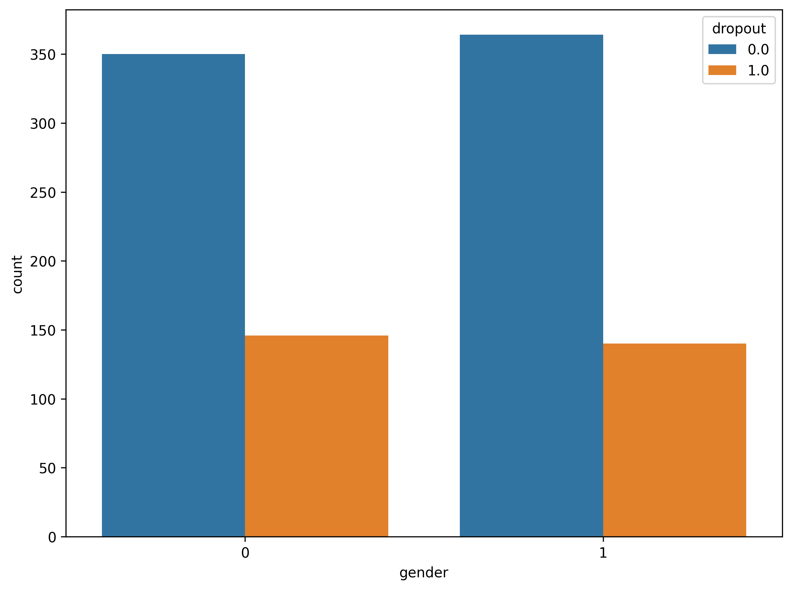
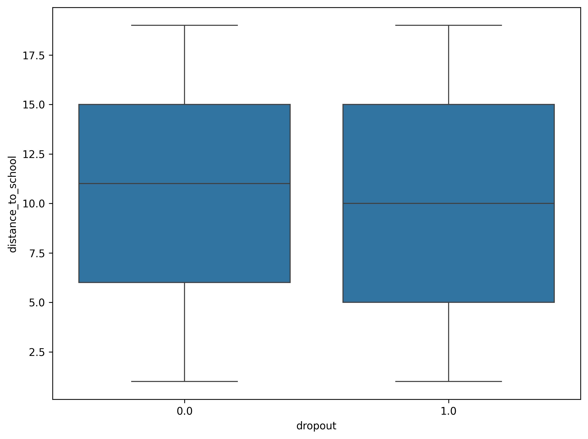
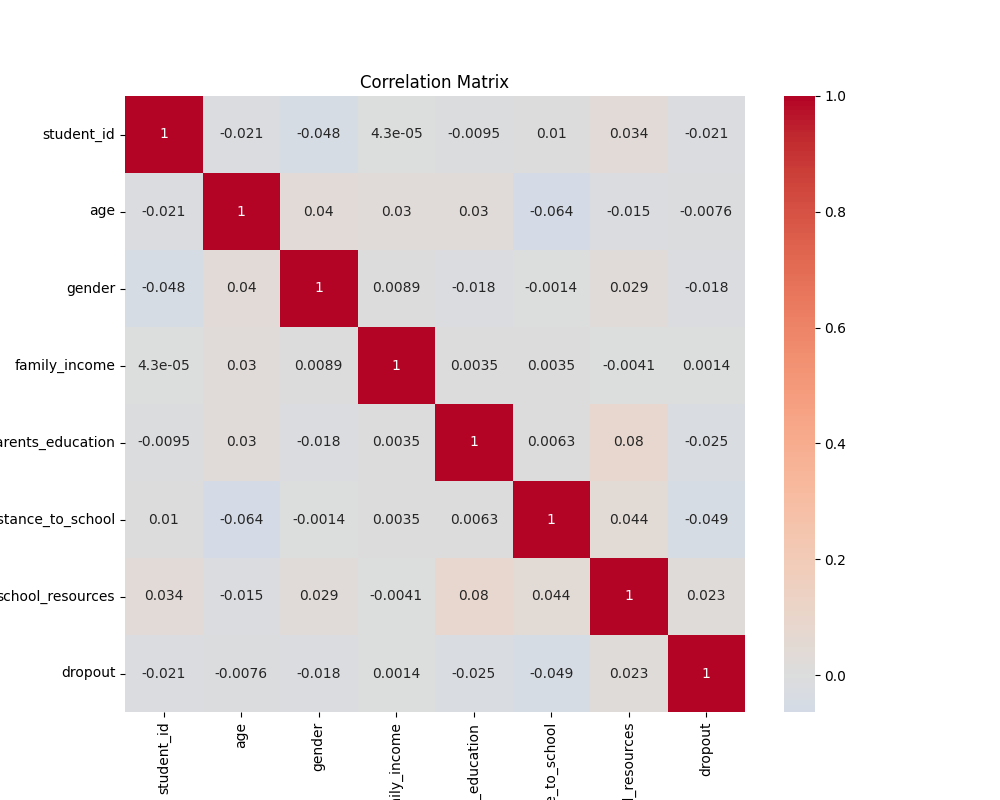
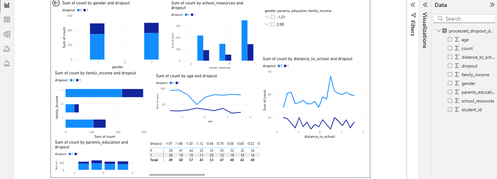

# Names: Isimbi Mushimire Iris
# ID: 27121

## BIG DATA PROJECT

# 📚 School Dropout Prediction in Rural Rwanda

## 🎯 Project Overview

This project is part of my final capstone. It addresses the challenge of **predicting primary school dropout in rural Rwanda** using socio-economic indicators.


## 🧠 Problem Statement

In rural Rwanda, dropout rates among primary school children remain a persistent problem. The goal of this project is to **leverage data analytics to identify key factors contributing to dropout** and create a **predictive model** that can be used by education stakeholders to take proactive measures.


## 📊 Dataset Details

- **Source**: A simulated dataset reflecting socio-economic conditions in rural Rwanda.
- **Number of Records**: 1,000 students
- **Features Used**:
  - `age`: Age of the student
  - `gender`: Male or Female
  - `family_income`: Household income level (Very Low, Low, Medium, High)
  - `parents_education`: Highest education level of the parents (None to Higher)
  - `distance_to_school`: Distance in kilometers from home to school
  - `school_resources`: Level of school resources (Low to High)
  - `dropout`: Binary label (1 = Dropped Out, 0 = Enrolled)


## 🧼 Python Analytics Process 

### ✅ Step 1: Data Cleaning

- Handled missing values using:
  - **Median** imputation for numeric columns
  - **Most frequent value (mode)** for categorical variables
- Removed or replaced invalid entries
- Confirmed dataset integrity after cleaning

### ✅ Step 2: Data Preprocessing

- **Encoded categorical variables** (e.g., gender, education) using `LabelEncoder`
- Applied **StandardScaler** to scale numeric values (important for distance/age)
- Split the dataset into training and testing sets using `train_test_split`

### ✅ Step 3: Exploratory Data Analysis (EDA)

- **Bar charts** visualizing dropout across gender, income, and parents’ education
- **Boxplot** of distance to school vs dropout status
- **Correlation heatmap** showing relationships between variables

Visualizations saved as:
- `dropout_by_gender.png`
- `dropout_by_income.png`
- `correlation_matrix.png`, etc.

### ✅ Step 4: Machine Learning Model

- Used **Random Forest Classifier** for prediction
- Trained model on 70% of the data, tested on 30%
- Evaluated using:
  - Accuracy
  - Classification Report (Precision, Recall, F1 Score)
  - Confusion Matrix

### ✅ Step 5: Feature Importance

- Extracted and visualized feature importances from the model
- Found that **family income**, **parents' education**, and **distance to school** were strong predictors of dropout

## 💡 Innovation Component 

- Created a **custom Python function**: `predict_dropout_risk(model, student_data)` to:
  - Accept new student input (e.g., age, income level)
  - Return a **dropout risk prediction**
  - Provide a **dropout probability (%)**

- Example Output:

- This function demonstrates how the model can be applied in real-world scenarios for early intervention.


## 📈 Power BI Dashboard 

A multi-page Power BI dashboard was created using the processed data.

### ✅ Page 1: Executive Summary
- KPI cards showing:
- Total Students
- Number of Dropouts
- Dropout Rate (%)

### ✅ Page 2: Dropout by Demographics
- **Bar charts** for:
- Dropout by Gender

- Dropout by Family Income

- Dropout by Parents' Education

### ✅ Page 3: Distance Insights
- **Boxplot**of distance to school vs dropout status

- **Line chart** for dropout trends (if time data is included)


 **Correlation heatmap** showing relationships between all features
 
### ✅ Page 4: AI Visuals (Key Influencers & Decomposition Tree)
- Identifies factors that most influence the likelihood of dropout

### ✅ Page 5: Interactivity & Innovation
- Slicers for gender, income, and parents' education
- Drill-down functionality
- Custom tooltips and **bookmarks** to toggle between filtered views


## 📌 Screenshots (To Be Added in GitHub)

### 🔹 Dashboard Overview


### 🔹 Feature Importance


## 🛠 How to Use This Project 

### 🧑‍💻 Clone the Repository

```bash
git clone https://github.com/irisisimbi/school_dropout_predictions.git

